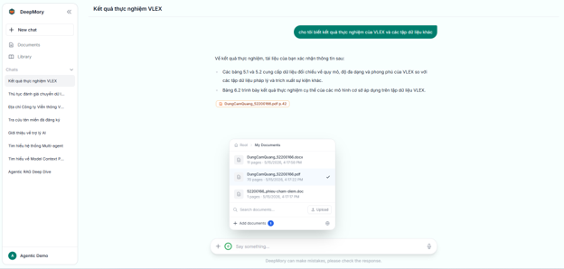
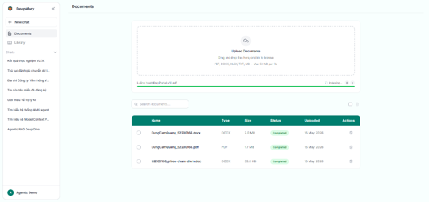
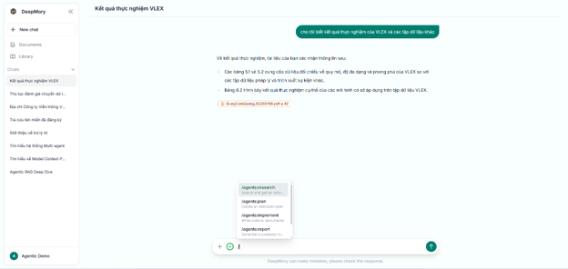

# Mera

Mera is an advanced knowledge base mining project that enables intelligent Question & Answering (Q&A) on both user-uploaded documents and the enterprise's central data repository. 

## System Interface





## Key Features

- **Long-term and short-term memory**: By exploiting both short-term and long-term memory, Mera helps retain user context for longer periods and remembers important information, ultimately saving users valuable time.
- **Agents**: Provides a robust set of agents to support automated workflows, including planner, searching, implement, and testing agents.
- **Document digitization**: Automatically converts uploaded images and various file formats into digital documents to facilitate easy and accurate Q&A.
- **Specific citations**: The information utilized by the chatbot to answer user queries includes explicit citations, clearly indicating the exact page and section of the source document for easy cross-referencing and verification.

## Quick Start

### Prerequisites

- Python (v3.10+)
- Node.js (v18+)
- PostgreSQL (Optional, falls back to JSON)
- Redis (Optional, for caching)

### Installation

1. Backend Setup
   ```bash
   cd server
   python -m venv .venv
   # Activate: .venv\Scripts\Activate (Windows) or source .venv/bin/activate (Linux/Mac)
   pip install -r requirements.txt
   ```

2. Frontend Setup
   ```bash
   npm install
   ```

### Configuration

Backend (server/.env):
```env
PORT=3000
HOST=0.0.0.0
FRONTEND_URL=http://localhost:5173

# Database
USE_DATABASE=true
DB_HOST=localhost
DB_PORT=5432
DB_NAME=mera
DB_USER=mera
DB_PASSWORD=your_password
```

Frontend (.env):
```env
VITE_API_URL=http://localhost:3000/api
VITE_SOCKET_URL=http://localhost:3000
```

### Running the Application

**Terminal 1: Backend**
```bash
cd server
python main.py
```

**Terminal 2: Frontend**
```bash
npm run dev
```

If you find this project useful, please consider giving it a star!