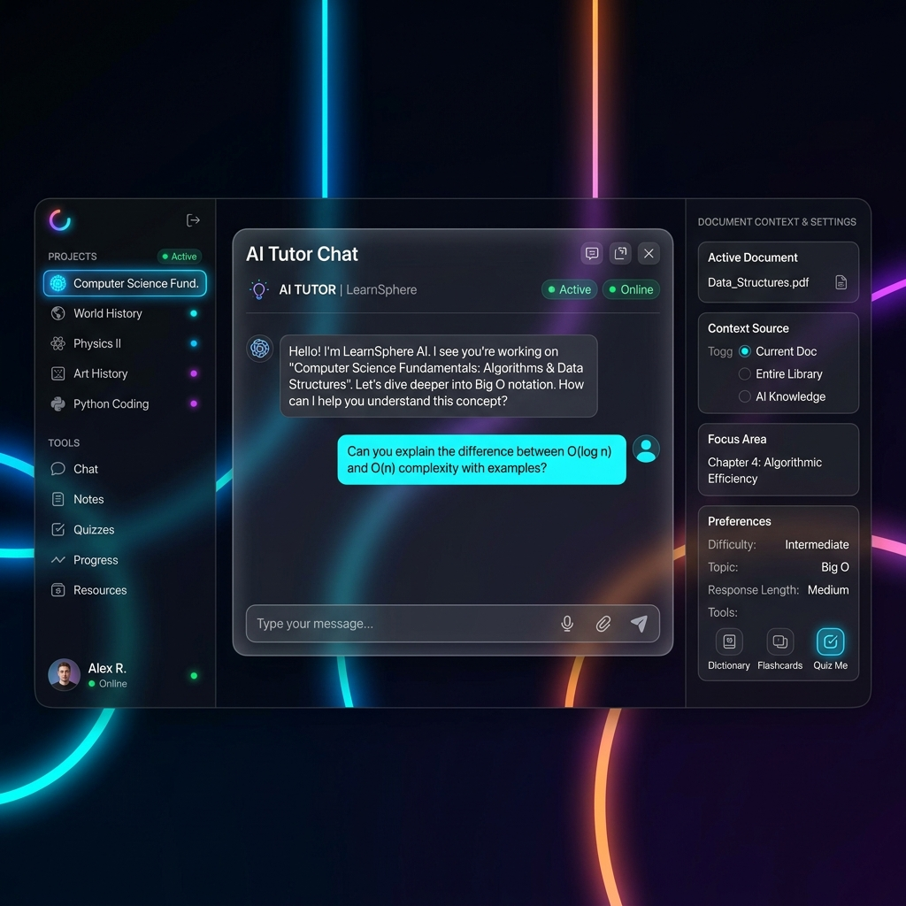

# Mera

Mera is a modern chatbot application with a modular Python backend and React frontend.

## System Interface



## Key Features

- Modular Architecture - Domain-driven backend design
- Real-time Communication - Supports both SSE Streaming and WebSocket
- LLM Integration - Support for Ollama, OpenAI, Gemini, vLLM via provider pattern
- Persistence - PostgreSQL with JSON fallback
- Project Management - Organize chats into projects with document context (RAG)
- MCP Support - Extensible via Model Context Protocol

## Quick Start

### Prerequisites

- Python (v3.10+)
- Node.js (v18+)
- PostgreSQL (Optional, falls back to JSON)
- Redis (Optional, for caching)

### Installation

1. Backend Setup
   ```bash
   cd server
   python -m venv .venv
   # Activate: .venv\Scripts\Activate (Windows) or source .venv/bin/activate (Linux/Mac)
   pip install -r requirements.txt
   ```

2. Frontend Setup
   ```bash
   npm install
   ```

### Configuration

Backend (server/.env):
```env
PORT=3000
HOST=0.0.0.0
FRONTEND_URL=http://localhost:5173

# Database
USE_DATABASE=true
DB_HOST=localhost
DB_PORT=5432
DB_NAME=mera
DB_USER=mera
DB_PASSWORD=your_password

# LLM Config
LLM_PROVIDER=ollama
LLM_MODEL=mistral
OLLAMA_BASE_URL=http://localhost:11434/v1
```

Frontend (.env):
```env
VITE_API_URL=http://localhost:3000/api
VITE_SOCKET_URL=http://localhost:3000
```

### Running the Application

Terminal 1: Backend
```bash
cd server
python main.py
```
Server runs on http://localhost:3000

Terminal 2: Frontend
```bash
npm run dev
```
Frontend runs on http://localhost:5173

## Project Structure

```
mera/
├── server/
│   ├── modules/              # Feature modules
│   ├── common/               # Shared utilities
│   ├── config/               # Configuration
│   ├── testing/              # Verification scripts
│   ├── api_router.py         # Main router
│   └── main.py               # Entry point
├── src/                      # React Frontend
├── data/                     # Data storage (JSON/Uploads)
├── docs/                     # Documentation and images
└── README.md
```

If you find this project useful, please consider giving it a star!